

    
  
     
  <h1 style="font-size: 2.2rem; color: #1a1a1a; margin-bottom: 2rem; border: none; font-weight: bold;">Documento de Especificación del Proyecto: Sistema de Pagos de Servicios Públicos</h1>
    
  

    
<strong>Asignatura:</strong> Ingeniería de Software

    
<strong>Nombre:</strong> Alejandro Gutierrez Henao

    
<strong>Correo institucional:</strong> agutierrezh105175@umanizales.edu.co

    
<strong>Fecha:</strong> 1/09/2026

  

# Tabla de Contenidos

- [1. Identificación de Funcionalidades de Negocio del Dominio](#sec-1)
  - [Módulo A: Gestión de Clientes y Cuentas Bancarias](#sec-1-mod-a)
  - [Módulo B: Gestión de Facturas y Servicios](#sec-1-mod-b)
  - [Módulo C: Procesamiento de Pagos](#sec-1-mod-c)
  - [Módulo D: Operaciones Avanzadas y Soporte](#sec-1-mod-d)
- [2. Fase 1: Requisitos — Historias de Usuario y Casos de Uso](#sec-2)
  - [2.1. Matriz de Roles y Responsabilidades](#sec-2-1)
  - [2.2. Historias de Usuario (Formato Connextra en Jira)](#sec-2-2)
    - [HU-01: Registro y Gestión del Perfil del Cliente](#hu-01)
    - [HU-02: Apertura y Vinculación de Cuentas Bancarias](#hu-02)
    - [HU-03: Consulta de Saldos y Estados de Cuenta](#hu-03)
    - [HU-04: Inscripción y Gestión de Servicios Públicos](#hu-04)
    - [HU-05: Consulta de Facturas Pendientes](#hu-05)
    - [HU-06: Notificaciones y Alertas de Vencimiento](#hu-06)
    - [HU-07: Pago Inmediato de Facturas (Cuenta de Ahorros / Corriente)](#hu-07)
    - [HU-08: Pago Parcial o Acumulado de Facturas](#hu-08)
    - [HU-09: Domiciliación y Pago Automático de Servicios](#hu-09)
    - [HU-10: Generación y Descarga de Comprobantes de Pago](#hu-10)
    - [HU-11: Reversión y Anulación de Pagos](#hu-11)
    - [HU-12: Historial Consolidado y Reportes de Pago](#hu-12)
  - [2.3. Casos de Uso del Sistema](#sec-2-3)
    - [2.3.1 Glosario del Dominio](#sec-2-3-1)
    - [Módulo A: Gestión de Clientes y Cuentas Bancarias](#sec-2-3-mod-a)
    - [Módulo B: Gestión de Facturas y Servicios](#sec-2-3-mod-b)
    - [Módulo C: Procesamiento de Pagos](#sec-2-3-mod-c)
    - [Módulo D: Operaciones Avanzadas y Soporte](#sec-2-3-mod-d)
- [3. Fase 2: Diseño de Arquitectura de Software](#sec-3)
  - [3.1. Diagrama de Arquitectura Multicapa del Sistema](#sec-3-1)
    - [3.1.2. Especificación de Componentes de Arquitectura](#sec-3-1-2)
  - [3.2 Diagrama de Contexto C4](#sec-3-2)
  - [3.3. Diagrama de Clases](#sec-3-3)
  - [3.4. Diagrama Entidad-Relación (ER)](#sec-3-4)
  - [3.5. Diagrama de Secuencia — Flujo "Procesar Pago de Servicio Inmediato"](#sec-3-5)
    - [3.5.1 Flujo "Procesar Pago de Servicio Inmediato"](#sec-3-5-1)
    - [3.5.2. Flujo "Ejecución de Domiciliaciones (Proceso Batch)"](#sec-3-5-2)

---

## 1. Identificación de Funcionalidades de Negocio del Dominio

Para el sistema de pagos de servicios públicos, se han identificado las siguientes funcionalidades de negocio, abarcando desde los procesos centrales más importantes hasta las operaciones complementarias del dominio:

### Módulo A: Gestión de Clientes y Cuentas Bancarias
1. **Registro y gestión del perfil del cliente:** Creación, actualización y validación de los datos personales y de contacto del cliente en la plataforma.
2. **Apertura y vinculación de cuentas bancarias:** Registro y asociación de cuentas corrientes y cuentas de ahorros al cliente, incluyendo la validación de sus estados (activa, bloqueada).
3. **Consulta de saldos y estados de cuenta:** Visualización detallada y en tiempo real del saldo disponible y movimientos de las cuentas de ahorros y corrientes.

### Módulo B: Gestión de Facturas y Servicios
4. **Inscripción y gestión de servicios:** Asignación y guardado de números de referencia/contrato de servicios públicos (agua, luz, gas, internet) a la cuenta del cliente.
5. **Consulta y sincronización de facturas pendientes:** Obtención en tiempo real del monto, fecha de emisión, fecha de vencimiento y recargos de las facturas enviadas por las empresas prestadoras.
6. **Notificaciones y alertas de vencimiento:** Envío de avisos automáticos por canal digital sobre facturas próximas a vencer o en mora.

### Módulo C: Procesamiento de Pagos
7. **Pago inmediato/puntual de facturas:** Debitación directa del saldo de la cuenta de ahorros o corriente para el pago total de una factura seleccionada.
8. **Pago parcial o acumulado de facturas:** Capacidad de realizar abonos parciales a una factura o seleccionar múltiples facturas para abonar en una sola transacción.
9. **Domiciliación y pago automático:** Programación de débito automático recurrente contra la cuenta elegida en la fecha de vencimiento del servicio.
10. **Generación y emisión de comprobantes de pago:** Emisión, visualización y descarga digital del certificado oficial del pago realizado.

### Módulo D: Operaciones Avanzadas y Soporte
11. **Reversión y anulación de pagos:** Gestión y tramitación de solicitudes de reembolso o anulación por pagos duplicados, erróneos o transacciones no procesadas correctamente.
12. **Historial consolidado y reportes de pago:** Búsqueda avanzada, filtrado y exportación de transacciones pasadas por rangos de fecha, tipo de servicio o cuenta originaria.

---

## 2. Fase 1: Requisitos — Historias de Usuario y Casos de Uso

### 2.1. Matriz de Roles y Responsabilidades

| Rol | Descripción | Responsabilidades y Permisos |
| :--- | :--- | :--- |
| **Cliente** | Usuario final titular de cuentas bancarias y consumidor de servicios públicos. | • Consultar facturas pendientes. • Realizar pagos de servicios inmediatos. • Configurar y cancelar domiciliaciones de pago. • Consultar historial de pagos y descargar comprobantes PDF. • Solicitar reversión de transacciones. |
| **Administrador** | Usuario interno de la entidad financiera encargado de la gestión de la plataforma. | • Dar de alta y gestionar empresas de servicios públicos (endpoints, NIT). • Auditar transacciones y consultar registros de auditoría (*logs*). • Aprobar o rechazar solicitudes de reversión de pago. • Generar reportes consolidados de recaudo. |
| **Sistema Batch / Cron** | Proceso automático interno ejecutado en segundo plano (*Worker*). | • Procesar las domiciliaciones programadas para la fecha actual. • Notificar resultados (exitosos/fallidos) a los clientes vía email. • Registrar intentos de cobro en la base de datos. |

### 2.2. Historias de Usuario (Formato Connextra en Jira)

**Enlace de visualización en Jira:** https://agutih.atlassian.net/issues/?jql=issueKey+in+%28KAN-4%2CKAN-5%2CKAN-6%2CKAN-7%2CKAN-8%2CKAN-9%2CKAN-10%2CKAN-11%2CKAN-12%2CKAN-13%2CKAN-14%2CKAN-15%29&atlOrigin=eyJpIjoiNDgxMmM1NmNkNmRmNDdmZGJlMmNmNTIwMjdiN2E3ZWQiLCJwIjoiaiJ9

#### HU-01: Registro y Gestión del Perfil del Cliente
Como usuario nuevo, quiero registrarme en la plataforma ingresando mis datos personales y de contacto, para acceder de forma segura al sistema de gestión de pagos de servicios públicos.

**Criterios de Aceptación:**  
  1. El sistema valida que el correo electrónico y número de documento sean únicos en el sistema.  
  2. Se requiere una contraseña segura conforme a políticas de seguridad.  
  3. El usuario puede actualizar su información de contacto posteriormente desde su perfil.

#### HU-02: Apertura y Vinculación de Cuentas Bancarias
Como cliente registrado, quiero vincular mis cuentas de ahorros o cuentas corrientes existentes al sistema, para utilizarlas como origen de fondos al momento de pagar mis servicios.

**Criterios de Aceptación:**
  1. El sistema permite seleccionar el tipo de cuenta (Cuenta de Ahorros o Cuenta Corriente).  
  2. Valida la existencia y estado activo de la cuenta contra el core bancario.  
  3. Un cliente puede registrar múltiples cuentas bancarias asociadas a su perfil.

#### HU-03: Consulta de Saldos y Estados de Cuenta
Como cliente con cuentas bancarias registradas, quiero consultar en tiempo real el saldo disponible y los movimientos de mis cuentas de ahorros y corrientes, para verificar fondos antes de realizar cualquier transacción.

**Criterios de Aceptación:**  
  1. Se muestra de forma clara el saldo actual y disponible de cada cuenta vinculada.  
  2. Permite visualizar un listado de los últimos movimientos o débitos recientes realizados en la cuenta.

#### HU-04: Inscripción y Gestión de Servicios Públicos
Como cliente del sistema, quiero registrar y asociar los números de referencia o contrato de mis servicios públicos (agua, luz, gas, etc.), para mantenerlos guardados y facilitar su consulta y pago recurrente.

**Criterios de Aceptación:**  
  1. El usuario ingresa la empresa prestadora y el número de referencia/contrato del servicio.  
  2. El sistema valida el formato del número de contrato según la empresa proveedora.  
  3. Permite eliminar o editar los servicios guardados.

#### HU-05: Consulta de Facturas Pendientes
Como cliente con servicios inscritos, quiero consultar las facturas pendientes de pago asociadas a mis contratos, para conocer los montos exactos y las fechas límite de vencimiento.

**Criterios de Aceptación:**
  1. El sistema consulta de forma síncrona o asíncrona con el proveedor el estado actual de la factura.  
  2. Se despliega el valor a pagar, fecha de emisión, fecha de recargo y fecha límite de pago.  
  3. Muestra claramente si la factura se encuentra vigente o vencida.

#### HU-06: Notificaciones y Alertas de Vencimiento
Como cliente registrado, quiero recibir alertas automáticas por correo electrónico sobre el vencimiento próximo de mis facturas, para evitar recargos o la suspensión de los servicios públicos.  

**Criterios de Aceptación:**  
  1. El sistema dispara una alerta automática 3 días antes de la fecha límite de pago.  
  2. Envía un aviso inmediato en caso de que una factura llegue al estado de vencida.

#### HU-07: Pago Inmediato de Facturas (Cuenta de Ahorros / Corriente)
Como cliente con saldo disponible, quiero realizar el pago total de una factura seleccionando una de mis cuentas de ahorros o cuentas corrientes, para cancelar mis obligaciones de manera instantánea.

**Criterios de Aceptación:**  
  1. El usuario selecciona la factura y la cuenta de origen (ahorros o corriente).  
  2. El sistema valida el saldo disponible en tiempo real antes de procesar el débito.  
  3. Si el saldo es suficiente, se ejecuta la transacción, se descuenta el valor de la cuenta, se actualiza la factura a estado "Pagada" y se registra el pago.

#### HU-08: Pago Parcial o Acumulado de Facturas
Como cliente con restricciones de liquidez o múltiples deudas,
quiero realizar un abono parcial a una factura o seleccionar varias facturas para pagarlas en una sola transacción, para gestionar de manera flexible mis finanzas.  

**Criterios de Aceptación:**  
  1. El sistema permite ingresar un valor inferior al total de la factura si la empresa proveedora lo permite (pago parcial).  
  2. Permite seleccionar un lote de varias facturas pendientes para generar un pago consolidado por el valor total acumulado.

#### HU-09: Domiciliación y Pago Automático de Servicios
Como cliente recurrente, quiero configurar el débito automático de un servicio vinculado a una de mis cuentas, para que las facturas se paguen de forma automática en su fecha de vencimiento sin intervención manual.  

**Criterios de Aceptación:**
  1. El usuario habilita la opción de domiciliación seleccionando el servicio y la cuenta de débito predeterminada.  
  2. El motor de procesos ejecuta el pago automáticamente el día del vencimiento si la factura está disponible y la cuenta tiene fondos.

#### HU-10: Generación y Descarga de Comprobantes de Pago
Como cliente que ha efectuado un pago con éxito, quiero generar y descargar un comprobante de pago en formato digital (PDF), para conservar constancia formal de la transacción realizada.

**Criterios de Aceptación:**  
  1. Tras completarse el pago, se habilita inmediatamente un botón de descarga del comprobante.  
  2. El documento incluye los datos del cliente, la cuenta utilizada, el servicio, el valor pagado, la fecha/hora y un código único de transacción.

#### HU-11: Reversión y Anulación de Pagos
Como cliente que ha cometido un error o sufrido un cobro duplicado, quiero solicitar la reversión o anulación de un pago realizado, para que los fondos sean devueltos a mi cuenta de origen.

**Criterios de Aceptación:**  
  1. Se permite solicitar la reversión dentro de un margen de tiempo estipulado (ej. 24 horas).  
  2. Requiere justificación del motivo de la anulación.  
  3. El sistema valida el caso con el área administrativa y el proveedor para ejecutar la nota de crédito y reintegrar el dinero a la cuenta del cliente.

#### HU-12: Historial Consolidado y Reportes de Pago
Como cliente de la plataforma, quiero consultar el historial completo de mis pagos realizados filtrando por rangos de fecha y tipo de cuenta, para llevar un control detallado de mis egresos históricos.

**Criterios de Aceptación:**  
  1. El módulo de historial muestra una tabla con todos los pagos registrados del cliente.  
  2. Permite filtrar los resultados por fechas, servicios y cuentas de ahorros/corrientes utilizadas.  
  3. Permite exportar los resultados a formatos comunes (CSV/PDF).

---

### 2.3. Casos de Uso del Sistema

### 2.3.1 Glosario del Dominio

| Término | Definición |
| :--- | :--- |
| **Core Bancario** | Sistema central de la entidad financiera encargado de la gestión de cuentas, saldos, débitos y acreditaciones de fondos. |
| **Domiciliación** | Proceso de pago automático mediante el cual un cliente autoriza el débito recurrente de facturas desde su cuenta bancaria. |
| **Empresa de Servicio Público** | Entidad prestadora de servicios esenciales (e.g., CHEC, Efigas, Aguas) que genera facturación y recibe pagos. |
| **Factura / Referencia de Pago** | Identificador único de cobro emitido por la empresa de servicios que detalla el monto a pagar y la fecha de vencimiento. |
| **Reversión de Pago** | Operación mediante la cual se anula un pago procesado previamente y se devuelven los fondos a la cuenta del cliente debido a reclamaciones o inconsistencias. |

---

#### Módulo A: Gestión de Clientes y Cuentas Bancarias

| Campo | Detalle |
|---|---|
| **Código** | **CU-01** |
| **Nombre** | Registrar Cliente |
| **Actor(es)** | Cliente, Administrador |
| **Descripción** | Permite crear y dar de alta a un nuevo cliente en la plataforma registrando sus datos personales y credenciales de acceso. |
| **Precondiciones** | Ninguna. |
| **Postcondiciones** | El registro del cliente se almacena en la base de datos con estado "Activo". |
| **Flujos Alternativos / Excepción** | **FA01:** Si el tipo/número de documento o el correo ya están registrados, el sistema muestra error y cancela el registro. **FA02:** Si la contraseña no cumple con las políticas de complejidad, el sistema solicita corregirla. |

| Campo | Detalle |
|---|---|
| **Código** | **CU-02** |
| **Nombre** | Consultar Perfil de Cliente |
| **Actor(es)** | Cliente, Administrador |
| **Descripción** | Permite visualizar la información personal, datos de contacto y estado actual de la cuenta del cliente. |
| **Precondiciones** | El cliente o administrador debe contar con una sesión activa en el sistema. |
| **Postcondiciones** | Se despliegan en pantalla los datos detallados del usuario. |
| **Flujos Alternativos / Excepción** | **FA01:** Si el usuario no tiene permisos o la sesión ha expirado, el sistema redirige al inicio de sesión. |

| Campo | Detalle |
|---|---|
| **Código** | **CU-03** |
| **Nombre** | Actualizar Datos del Cliente |
| **Actor(es)** | Cliente, Administrador |
| **Descripción** | Permite modificar la información de contacto (teléfono, dirección, correo electrónico) o preferencias del cliente. |
| **Precondiciones** | El cliente debe estar autenticado en el sistema. |
| **Postcondiciones** | Se actualizan los datos del cliente en la base de datos y se registra la fecha de modificación. |
| **Flujos Alternativos / Excepción** | **FA01:** Si el cliente intenta modificar un dato no editable (como el número de documento), el campo se muestra bloqueado. **FA02:** Si el nuevo correo ingresado ya pertenece a otro usuario, el sistema bloquea la actualización. |

| Campo | Detalle |
|---|---|
| **Código** | **CU-04** |
| **Nombre** | Inactivar / Eliminar Cuenta de Cliente |
| **Actor(es)** | Cliente, Administrador |
| **Descripción** | Permite cambiar el estado del cliente a "Inactivo" o eliminar lógicamente su perfil del sistema. |
| **Precondiciones** | El cliente debe estar autenticado o ser gestionado por un administrador. |
| **Postcondiciones** | El cliente queda imposibilitado para iniciar sesión o realizar transacciones. |
| **Flujos Alternativos / Excepción** | **FA01:** Si el cliente tiene pagos pendientes o débitos automáticos programados activos, el sistema rechaza la eliminación hasta cancelar dichos servicios. |

| Campo | Detalle |
|---|---|
| **Código** | **CU-05** |
| **Nombre** | Vincular / Registrar Cuenta Bancaria |
| **Actor(es)** | Cliente, Core Bancario |
| **Descripción** | Permite asociar una nueva cuenta bancaria (especificando si es Cuenta de Ahorros o Cuenta Corriente) al perfil del cliente. |
| **Precondiciones** | Cliente autenticado en el sistema. |
| **Postcondiciones** | La cuenta bancaria queda vinculada y validada en el sistema para realizar débitos. |
| **Flujos Alternativos / Excepción** | **FA01:** Si el número de cuenta no existe en el Core Bancario, se deniega la vinculación. **FA02:** Si la cuenta se encuentra embargada, inactiva o bloqueada en el banco, el sistema muestra la restricción. |

| Campo | Detalle |
|---|---|
| **Código** | **CU-06** |
| **Nombre** | Consultar Cuentas Bancarias Vinculadas |
| **Actor(es)** | Cliente |
| **Descripción** | Despliega el listado de todas las cuentas bancarias (ahorros/corriente) que el cliente tiene asociadas en la plataforma. |
| **Precondiciones** | Cliente autenticado. |
| **Postcondiciones** | Muestra el listado con el tipo de cuenta, número enmascarado y estado de la vinculación. |
| **Flujos Alternativos / Excepción** | **FA01:** Si el cliente no posee cuentas registradas, se presenta una pantalla informativa para invitar a vincular una. |

| Campo | Detalle |
|---|---|
| **Código** | **CU-07** |
| **Nombre** | Actualizar Preferencias de Cuenta Bancaria |
| **Actor(es)** | Cliente |
| **Descripción** | Permite cambiar la cuenta preferente/predeterminada para realizar pagos o modificar su apodo/alias personal. |
| **Precondiciones** | Cliente autenticado con al menos una cuenta vinculada. |
| **Postcondiciones** | La cuenta seleccionada queda marcada como "Predeterminada" para transacciones futuras. |
| **Flujos Alternativos / Excepción** | **FA01:** Si se intenta desmarcar la única cuenta predeterminada sin seleccionar otra, el sistema solicita elegir una sustituta. |

| Campo | Detalle |
|---|---|
| **Código** | **CU-08** |
| **Nombre** | Desvincular / Eliminar Cuenta Bancaria |
| **Actor(es)** | Cliente |
| **Descripción** | Permite remover la asociación entre una cuenta bancaria (ahorros o corriente) y el perfil del cliente en la plataforma. |
| **Precondiciones** | Cliente autenticado con la cuenta asociada. |
| **Postcondiciones** | Se elimina el registro de vinculación de la cuenta en el sistema. |
| **Flujos Alternativos / Excepción** | **FA01:** Si la cuenta está asignada como origen de pago para un débito automático activo, el sistema exige reasignar o cancelar la domiciliación antes de eliminar. |

| Campo | Detalle |
|---|---|
| **Código** | **CU-09** |
| **Nombre** | Consultar Saldo en Tiempo Real |
| **Actor(es)** | Cliente, Core Bancario |
| **Descripción** | Permite consultar el saldo disponible de una cuenta de ahorros o corriente específica antes de procesar una operación. |
| **Precondiciones** | La cuenta debe estar activa y vinculada al cliente. |
| **Postcondiciones** | Muestra en pantalla el saldo actual retenido y el saldo disponible para transaccionar. |
| **Flujos Alternativos / Excepción** | **FA01:** Si el Core Bancario no responde por tiempo de espera (timeout), se notifica que no se puede obtener el saldo en el momento. |

| Campo | Detalle |
|---|---|
| **Código** | **CU-10** |
| **Nombre** | Consultar Movimientos de Cuenta |
| **Actor(es)** | Cliente, Core Bancario |
| **Descripción** | Permite listar los débitos e ingresos recientes asociados a las cuentas de ahorros o corrientes registradas. |
| **Precondiciones** | Cliente autenticado y cuenta seleccionada. |
| **Postcondiciones** | Se presenta un desglose cronológico de las transacciones financieras efectuadas. |
| **Flujos Alternativos / Excepción** | **FA01:** Si la cuenta no registra movimientos en el rango consultado, la tabla se despliega vacía con una nota informativa. |

##### Diagrama de Casos de Uso — Módulo A
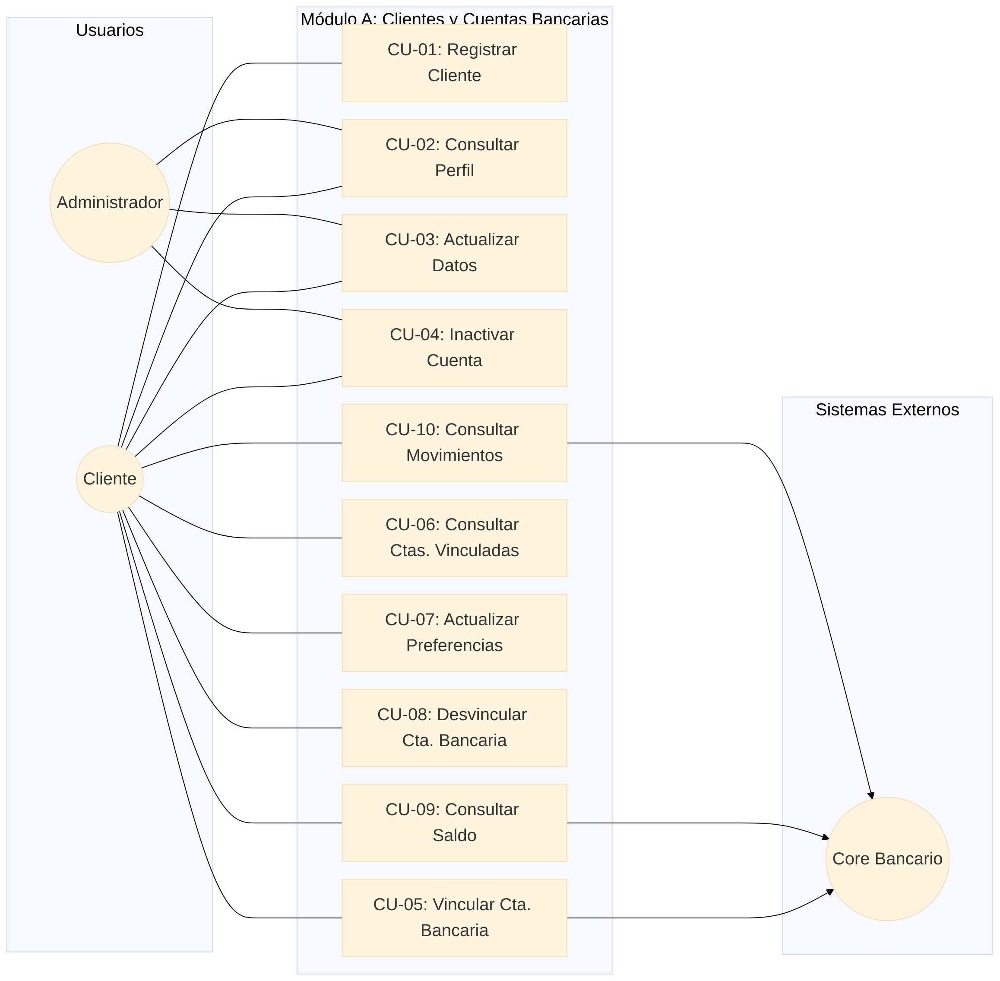

#### Módulo B: Gestión de Facturas y Servicios

| Campo | Detalle |
|---|---|
| **Código** | **CU-11** |
| **Nombre** | Inscribir Servicio Público |
| **Actor(es)** | Cliente, Empresas de Servicios |
| **Descripción** | Permite registrar un nuevo servicio público (agua, luz, gas, internet) ingresando la empresa prestadora y el número de contrato/referencia. |
| **Precondiciones** | Cliente autenticado en la plataforma. |
| **Postcondiciones** | El servicio queda guardado en la lista de servicios inscritos del cliente. |
| **Flujos Alternativos / Excepción** | **FA01:** Si el número de referencia/contrato no existe en el sistema de la empresa prestadora, se deniega la inscripción. **FA02:** Si el servicio ya se encuentra previamente inscrito por el mismo usuario, el sistema notifica el duplicado. |

| Campo | Detalle |
|---|---|
| **Código** | **CU-12** |
| **Nombre** | Consultar Servicios Públicos Inscritos |
| **Actor(es)** | Cliente |
| **Descripción** | Muestra el listado de todos los servicios públicos que el cliente tiene registrados en su cuenta. |
| **Precondiciones** | Cliente autenticado. |
| **Postcondiciones** | Se despliega en pantalla la lista de servicios con su alias, empresa proveedora y código de referencia. |
| **Flujos Alternativos / Excepción** | **FA01:** Si el cliente no tiene servicios inscritos, la interfaz muestra un mensaje informativo invitando a agregar uno. |

| Campo | Detalle |
|---|---|
| **Código** | **CU-13** |
| **Nombre** | Actualizar Servicio Público |
| **Actor(es)** | Cliente |
| **Descripción** | Permite modificar la información descriptiva del servicio inscrito, tal como asignarle un alias personal (ej. "Luz Casa", "Agua Oficina"). |
| **Precondiciones** | Cliente autenticado y servicio inscrito existente. |
| **Postcondiciones** | Se actualiza el alias o la etiqueta descriptiva del servicio en la base de datos. |
| **Flujos Alternativos / Excepción** | **FA01:** Si el usuario intenta modificar el código de referencia original de la factura, el sistema bloquea el campo y solicita eliminar el registro e inscribirlo de nuevo. |

| Campo | Detalle |
|---|---|
| **Código** | **CU-14** |
| **Nombre** | Eliminar / Desinscribir Servicio Público |
| **Actor(es)** | Cliente |
| **Descripción** | Permite remover un servicio público previamente asociado de la lista del cliente. |
| **Precondiciones** | Cliente autenticado y servicio inscrito seleccionado. |
| **Postcondiciones** | El servicio es removido de la cuenta del usuario. |
| **Flujos Alternativos / Excepción** | **FA01:** Si el servicio tiene configurada una domiciliación/débito automático activo, el sistema solicita confirmar la cancelación del pago automático antes de desinscribir. |

| Campo | Detalle |
|---|---|
| **Código** | **CU-15** |
| **Nombre** | Consultar Facturas Pendientes de Pago |
| **Actor(es)** | Cliente, Empresas de Servicios |
| **Descripción** | Permite consultar en tiempo real las facturas vigentes, por vencer o vencidas de los servicios inscritos. |
| **Precondiciones** | Tener al menos un servicio público inscrito. |
| **Postcondiciones** | Se presenta el valor total a pagar, fecha de emisión y fecha límite de pago para cada factura hallada. |
| **Flujos Alternativos / Excepción** | **FA01:** Si el servicio está al día y no registra facturas pendientes, el sistema indica que no hay cobros vigentes. **FA02:** Si la empresa prestadora del servicio no responde (timeout), el sistema muestra una alerta de indisponibilidad temporal para esa empresa. |

| Campo | Detalle |
|---|---|
| **Código** | **CU-16** |
| **Nombre** | Consultar Detalle de Factura |
| **Actor(es)** | Cliente, Empresas de Servicios |
| **Descripción** | Despliega los rubros específicos de una factura seleccionada (consumo, impuestos, mora, recargos y fecha límite). |
| **Precondiciones** | Existencia de una factura pendiente asociada a un servicio. |
| **Postcondiciones** | Muestra en pantalla el desglose del cobro de la factura. |
| **Flujos Alternativos / Excepción** | **FA01:** Si el detalle no puede ser obtenido desde el proveedor, se muestra únicamente el valor global consolidado a pagar. |

| Campo | Detalle |
|---|---|
| **Código** | **CU-17** |
| **Nombre** | Anular / Registrar Factura Remitida |
| **Actor(es)** | Empresas de Servicios, Administrador |
| **Descripción** | Permite actualizar el estado de una factura pendiente a "Anulada" o "Remitida" cuando la empresa prestadora emite un ajuste. |
| **Precondiciones** | Factura pendiente registrada en el sistema. |
| **Postcondiciones** | La factura cambia de estado y desaparece del listado de cobros pendientes del cliente. |
| **Flujos Alternativos / Excepción** | **FA01:** Si la factura ya había sido pagada previamente por el cliente, el sistema notifica el conflicto para que se genere un saldo a favor o nota de crédito. |

| Campo | Detalle |
|---|---|
| **Código** | **CU-18** |
| **Nombre** | Configurar Alertas y Notificaciones de Facturas |
| **Actor(es)** | Cliente |
| **Descripción** | Permite al usuario activar o desactivar la recepción de avisos automáticos y configurar los días previos al vencimiento para el envío de recordatorios. |
| **Precondiciones** | Cliente autenticado. |
| **Postcondiciones** | Se guardan las preferencias de notificación del usuario en la base de datos. |
| **Flujos Alternativos / Excepción** | **FA01:** Si el cliente no especifica correo o canal de notificación válido, el sistema no permite activar las alertas. |

| Campo | Detalle |
|---|---|
| **Código** | **CU-19** |
| **Nombre** | Enviar Alertas Automáticas de Vencimiento |
| **Actor(es)** | Motor de Notificaciones (Proceso Automático) |
| **Descripción** | Proceso del sistema que revisa diariamente las facturas por vencer y envía los correos de recordatorio configurados. |
| **Precondiciones** | Facturas pendientes cuya fecha límite coincida con la regla de notificación. |
| **Postcondiciones** | Se despacha el correo electrónico de aviso y se actualiza el log de notificaciones enviadas. |
| **Flujos Alternativos / Excepción** | **FA01:** Si el servicio de correo falla, el proceso encola el mensaje y programa un reintento. |

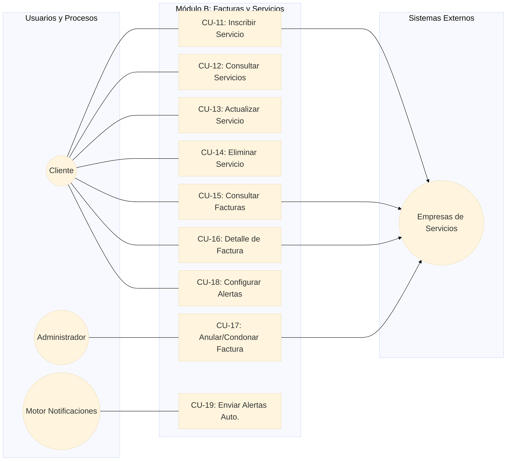

#### Módulo C: Procesamiento de Pagos

| Campo | Detalle |
|---|---|
| **Código** | **CU-20** |
| **Nombre** | Registrar Pago Inmediato (Pago Puntual) |
| **Actor(es)** | Cliente, Core Bancario, Empresas de Servicios |
| **Descripción** | Permite ejecutar el pago completo de una factura seleccionada debitando el monto exacto de una cuenta de ahorros o cuenta corriente activa. |
| **Precondiciones** | Cliente autenticado, factura en estado pendiente y saldo suficiente en la cuenta de origen. |
| **Postcondiciones** | Se registra la transacción con estado "Exitoso", se descuenta el saldo de la cuenta y la factura cambia a estado "Pagada". |
| **Flujos Alternativos / Excepción** | **FA01:** Si la cuenta no posee saldo suficiente, se deniega la transacción y se muestra la alerta. **FA02:** Si el Core Bancario descuenta el dinero pero la Empresa de Servicios no confirma la transacción (timeout/falla de red), el sistema marca el pago como "En verificación" e inicia protocolo de conciliación. |

| Campo | Detalle |
|---|---|
| **Código** | **CU-21** |
| **Nombre** | Registrar Pago Parcial de Factura |
| **Actor(es)** | Cliente, Core Bancario, Empresas de Servicios |
| **Descripción** | Permite abonar un valor inferior al saldo total de una factura, siempre que la empresa proveedora lo admita. |
| **Precondiciones** | Factura pendiente que permita abonos parciales y saldo disponible en la cuenta seleccionada. |
| **Postcondiciones** | Se realiza el débito por el monto ingresado, se reduce el saldo pendiente de la factura y se registra el abono parcial. |
| **Flujos Alternativos / Excepción** | **FA01:** Si la empresa proveedora no acepta pagos parciales, el sistema bloquea el campo de monto y notifica que se debe pagar la totalidad. |

| Campo | Detalle |
|---|---|
| **Código** | **CU-22** |
| **Nombre** | Registrar Pago Acumulado (Lote de Facturas) |
| **Actor(es)** | Cliente, Core Bancario, Empresas de Servicios |
| **Descripción** | Permite seleccionar múltiples facturas pendientes de diferentes servicios y procesar su pago consolidado en una sola transacción bancaria. |
| **Precondiciones** | Cliente autenticado con al menos dos facturas pendientes seleccionadas y saldo suficiente para cubrir la suma total. |
| **Postcondiciones** | Se debita la suma total en la cuenta de origen, se actualiza el estado de cada factura del lote a "Pagada" y se generan los registros de pago correspondientes. |
| **Flujos Alternativos / Excepción** | **FA01:** Si el saldo de la cuenta cubre solo algunas facturas del lote, el sistema no procesa la transacción global y solicita ajustar la selección o cambiar de cuenta. |

| Campo | Detalle |
|---|---|
| **Código** | **CU-23** |
| **Nombre** | Registrar / Activar Domiciliación de Pago (Débito Automático) |
| **Actor(es)** | Cliente |
| **Descripción** | Permite asociar una cuenta de ahorros o corriente a un servicio público para que sus facturas se paguen de forma automática en la fecha límite de pago. |
| **Precondiciones** | Cliente autenticado con servicio inscrito y cuenta bancaria vinculada. |
| **Postcondiciones** | Se crea una regla de domiciliación activa en el sistema asociada al servicio y a la cuenta elegida. |
| **Flujos Alternativos / Excepción** | **FA01:** Si el servicio ya cuenta con una domiciliación activa vinculada a otra cuenta, el sistema solicita confirmar la sustitución de la cuenta. |

| Campo | Detalle |
|---|---|
| **Código** | **CU-24** |
| **Nombre** | Consultar Domiciliaciones de Pago |
| **Actor(es)** | Cliente |
| **Descripción** | Despliega la lista de todas las reglas de débito automático configuradas para los servicios públicos del cliente. |
| **Precondiciones** | Cliente autenticado. |
| **Postcondiciones** | Muestra el listado de domiciliaciones indicando el servicio, la cuenta asignada y su estado (Activa / Suspendida). |
| **Flujos Alternativos / Excepción** | **FA01:** Si no hay domiciliaciones registradas, se presenta una pantalla informativa para configurar una. |

| Campo | Detalle |
|---|---|
| **Código** | **CU-25** |
| **Nombre** | Actualizar / Desactivar Domiciliación de Pago |
| **Actor(es)** | Cliente |
| **Descripción** | Permite cambiar la cuenta bancaria de origen asignada a la domiciliación o suspender/pausar el débito automático de un servicio. |
| **Precondiciones** | Existe una domiciliación previamente registrada. |
| **Postcondiciones** | Se actualiza la cuenta asignada o se modifica el estado de la domiciliación a "Inactiva". |
| **Flujos Alternativos / Excepción** | **FA01:** Si se intenta desactivar una domiciliación en el mismo día programado para la ejecución del cobro, el sistema advierte que el pago actual puede procesarse. |

| Campo | Detalle |
|---|---|
| **Código** | **CU-26** |
| **Nombre** | Ejecutar Pago por Domiciliación (Proceso Automático) |
| **Actor(es)** | Motor de Pagos Automáticos, Core Bancario, Empresas de Servicios |
| **Descripción** | Proceso batch que se ejecuta diariamente para identificar facturas que vencen en la fecha y debitar automáticamente el importe de la cuenta configurada. |
| **Precondiciones** | Domiciliación activa y existencia de factura pendiente en su fecha de vencimiento. |
| **Postcondiciones** | Se ejecuta el débito bancario, la factura se marca como "Pagada" y se envía notificación de resultado al cliente. |
| **Flujos Alternativos / Excepción** | **FA01:** Si la cuenta no posee fondos suficientes al momento de la ejecución, el proceso registra el fallo, cambia la factura a estado "Intento Fallido" y notifica de urgencia al usuario. |

| Campo | Detalle |
|---|---|
| **Código** | **CU-27** |
| **Nombre** | Generar Comprobante de Pago Digital |
| **Actor(es)** | Sistema, Cliente |
| **Descripción** | Construye y genera la certificación digital con los detalles completos del pago procesado para su consulta en pantalla o almacenamiento. |
| **Precondiciones** | Existencia de un registro de pago con estado "Exitoso". |
| **Postcondiciones** | Se expide la estructura del comprobante incluyendo ID de transacción, fecha, hora, monto, cuenta de origen enmascarada y referencia del servicio. |
| **Flujos Alternativos / Excepción** | **FA01:** Si la transacción está en estado "Pendiente" o "Revertido", el sistema no genera comprobante definitivo sino un estado de cuenta provisional. |

| Campo | Detalle |
|---|---|
| **Código** | **CU-28** |
| **Nombre** | Descargar Comprobante de Pago (PDF) |
| **Actor(es)** | Cliente |
| **Descripción** | Exporta y descarga en formato PDF el comprobante digital de un pago seleccionado del historial. |
| **Precondiciones** | Comprobante digital generado correctamente. |
| **Postcondiciones** | Se transfiere el archivo PDF al dispositivo del usuario. |
| **Flujos Alternativos / Excepción** | **FA01:** Si la generación del PDF falla por error en el renderizado, el sistema reintenta la compilación o muestra el resumen en HTML imprimible. |

#### Módulo C: Procesamiento de Pagos

| Campo | Detalle |
|---|---|
| **Código** | **CU-20** |
| **Nombre** | Registrar Pago Inmediato (Pago Puntual) |
| **Actor(es)** | Cliente, Core Bancario, Empresas de Servicios |
| **Descripción** | Permite ejecutar el pago completo de una factura seleccionada debitando el monto exacto de una cuenta de ahorros o cuenta corriente activa. |
| **Precondiciones** | Cliente autenticado, factura en estado pendiente y saldo suficiente en la cuenta de origen. |
| **Postcondiciones** | Se registra la transacción con estado "Exitoso", se descuenta el saldo de la cuenta y la factura cambia a estado "Pagada". |
| **Flujos Alternativos / Excepción** | **FA01:** Si la cuenta no posee saldo suficiente, se deniega la transacción y se muestra la alerta. **FA02:** Si el Core Bancario descuenta el dinero pero la Empresa de Servicios no confirma la transacción (timeout/falla de red), el sistema marca el pago como "En verificación" e inicia protocolo de conciliación. |

| Campo | Detalle |
|---|---|
| **Código** | **CU-21** |
| **Nombre** | Registrar Pago Parcial de Factura |
| **Actor(es)** | Cliente, Core Bancario, Empresas de Servicios |
| **Descripción** | Permite abonar un valor inferior al saldo total de una factura, siempre que la empresa proveedora lo admita. |
| **Precondiciones** | Factura pendiente que permita abonos parciales y saldo disponible en la cuenta seleccionada. |
| **Postcondiciones** | Se realiza el débito por el monto ingresado, se reduce el saldo pendiente de la factura y se registra el abono parcial. |
| **Flujos Alternativos / Excepción** | **FA01:** Si la empresa proveedora no acepta pagos parciales, el sistema bloquea el campo de monto y notifica que se debe pagar la totalidad. |

| Campo | Detalle |
|---|---|
| **Código** | **CU-22** |
| **Nombre** | Registrar Pago Acumulado (Lote de Facturas) |
| **Actor(es)** | Cliente, Core Bancario, Empresas de Servicios |
| **Descripción** | Permite seleccionar múltiples facturas pendientes de diferentes servicios y procesar su pago consolidado en una sola transacción bancaria. |
| **Precondiciones** | Cliente autenticado con al menos dos facturas pendientes seleccionadas y saldo suficiente para cubrir la suma total. |
| **Postcondiciones** | Se debita la suma total en la cuenta de origen, se actualiza el estado de cada factura del lote a "Pagada" y se generan los registros de pago correspondientes. |
| **Flujos Alternativos / Excepción** | **FA01:** Si el saldo de la cuenta cubre solo algunas facturas del lote, el sistema no procesa la transacción global y solicita ajustar la selección o cambiar de cuenta. |

| Campo | Detalle |
|---|---|
| **Código** | **CU-23** |
| **Nombre** | Registrar / Activar Domiciliación de Pago (Débito Automático) |
| **Actor(es)** | Cliente |
| **Descripción** | Permite asociar una cuenta de ahorros o corriente a un servicio público para que sus facturas se paguen de forma automática en la fecha límite de pago. |
| **Precondiciones** | Cliente autenticado con servicio inscrito y cuenta bancaria vinculada. |
| **Postcondiciones** | Se crea una regla de domiciliación activa en el sistema asociada al servicio y a la cuenta elegida. |
| **Flujos Alternativos / Excepción** | **FA01:** Si el servicio ya cuenta con una domiciliación activa vinculada a otra cuenta, el sistema solicita confirmar la sustitución de la cuenta. |

| Campo | Detalle |
|---|---|
| **Código** | **CU-24** |
| **Nombre** | Consultar Domiciliaciones de Pago |
| **Actor(es)** | Cliente |
| **Descripción** | Despliega la lista de todas las reglas de débito automático configuradas para los servicios públicos del cliente. |
| **Precondiciones** | Cliente autenticado. |
| **Postcondiciones** | Muestra el listado de domiciliaciones indicando el servicio, la cuenta asignada y su estado (Activa / Suspendida). |
| **Flujos Alternativos / Excepción** | **FA01:** Si no hay domiciliaciones registradas, se presenta una pantalla informativa para configurar una. |

| Campo | Detalle |
|---|---|
| **Código** | **CU-25** |
| **Nombre** | Actualizar / Desactivar Domiciliación de Pago |
| **Actor(es)** | Cliente |
| **Descripción** | Permite cambiar la cuenta bancaria de origen asignada a la domiciliación o suspender/pausar el débito automático de un servicio. |
| **Precondiciones** | Existe una domiciliación previamente registrada. |
| **Postcondiciones** | Se actualiza la cuenta asignada o se modifica el estado de la domiciliación a "Inactiva". |
| **Flujos Alternativos / Excepción** | **FA01:** Si se intenta desactivar una domiciliación en el mismo día programado para la ejecución del cobro, el sistema advierte que el pago actual puede procesarse. |

| Campo | Detalle |
|---|---|
| **Código** | **CU-26** |
| **Nombre** | Ejecutar Pago por Domiciliación (Proceso Automático) |
| **Actor(es)** | Motor de Pagos Automáticos, Core Bancario, Empresas de Servicios |
| **Descripción** | Proceso batch que se ejecuta diariamente para identificar facturas que vencen en la fecha y debitar automáticamente el importe de la cuenta configurada. |
| **Precondiciones** | Domiciliación activa y existencia de factura pendiente en su fecha de vencimiento. |
| **Postcondiciones** | Se ejecuta el débito bancario, la factura se marca como "Pagada" y se envía notificación de resultado al cliente. |
| **Flujos Alternativos / Excepción** | **FA01:** Si la cuenta no posee fondos suficientes al momento de la ejecución, el proceso registra el fallo, cambia la factura a estado "Intento Fallido" y notifica de urgencia al usuario. |

| Campo | Detalle |
|---|---|
| **Código** | **CU-27** |
| **Nombre** | Generar Comprobante de Pago Digital |
| **Actor(es)** | Sistema, Cliente |
| **Descripción** | Construye y genera la certificación digital con los detalles completos del pago procesado para su consulta en pantalla o almacenamiento. |
| **Precondiciones** | Existencia de un registro de pago con estado "Exitoso". |
| **Postcondiciones** | Se expide la estructura del comprobante incluyendo ID de transacción, fecha, hora, monto, cuenta de origen enmascarada y referencia del servicio. |
| **Flujos Alternativos / Excepción** | **FA01:** Si la transacción está en estado "Pendiente" o "Revertido", el sistema no genera comprobante definitivo sino un estado de cuenta provisional. |

| Campo | Detalle |
|---|---|
| **Código** | **CU-28** |
| **Nombre** | Descargar Comprobante de Pago (PDF) |
| **Actor(es)** | Cliente |
| **Descripción** | Exporta y descarga en formato PDF el comprobante digital de un pago seleccionado del historial. |
| **Precondiciones** | Comprobante digital generado correctamente. |
| **Postcondiciones** | Se transfiere el archivo PDF al dispositivo del usuario. |
| **Flujos Alternativos / Excepción** | **FA01:** Si la generación del PDF falla por error en el renderizado, el sistema reintenta la compilación o muestra el resumen en HTML imprimible. |

##### Diagrama de Casos de Uso — Módulo C

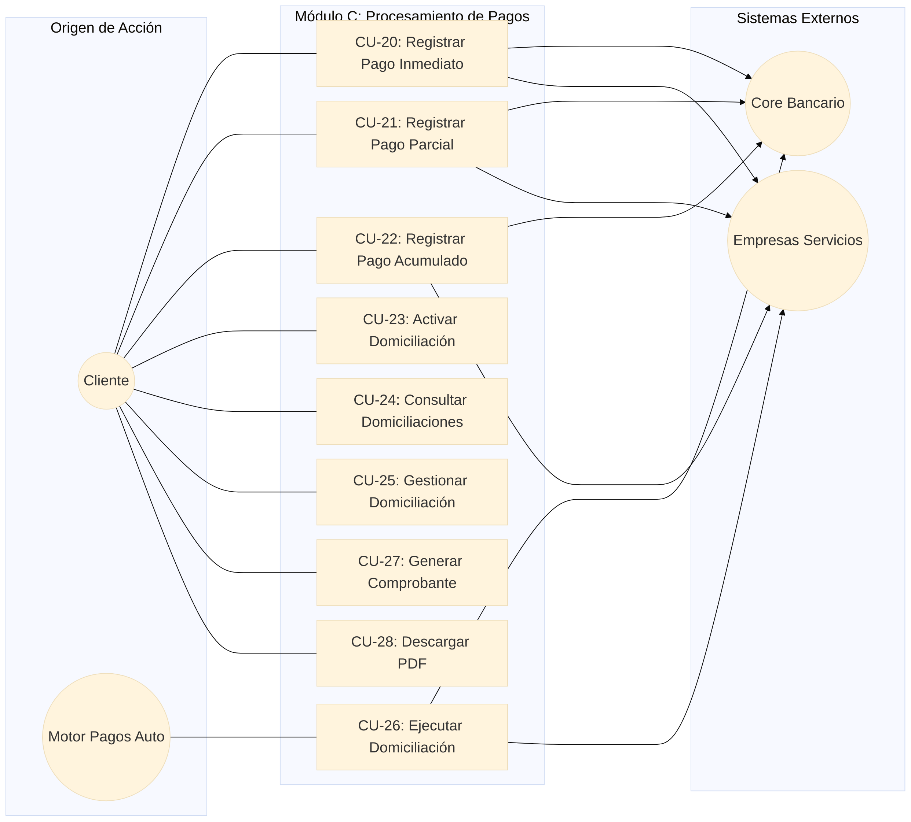

#### Módulo D: Operaciones Avanzadas y Soporte

| Campo | Detalle |
|---|---|
| **Código** | **CU-29** |
| **Nombre** | Solicitar Reversión de Pago |
| **Actor(es)** | Cliente |
| **Descripción** | Permite al cliente enviar una solicitud formal de anulación o reembolso de un pago realizado por error o cobro duplicado. |
| **Precondiciones** | Cliente autenticado y transacción de pago realizada dentro de la ventana de tiempo permitida (ej. últimas 24 horas). |
| **Postcondiciones** | Se registra la solicitud de reversión en estado "Pendiente de Revisión" y se notifica al área administrativa. |
| **Flujos Alternativos / Excepción** | **FA01:** Si el pago supera el tiempo límite configurado para reversiones directas, el sistema rechaza la solicitud e indica contactar a soporte. **FA02:** Si el pago ya cuenta con una solicitud de reversión previa en trámite, no se permite crear una duplicada. |

| Campo | Detalle |
|---|---|
| **Código** | **CU-30** |
| **Nombre** | Consultar Estado de Solicitud de Reversión |
| **Actor(es)** | Cliente, Administrador |
| **Descripción** | Permite revisar la trazabilidad, comentarios y respuesta dada a las solicitudes de reversión de pago radicadas. |
| **Precondiciones** | Existencia de al menos una solicitud de reversión registrada. |
| **Postcondiciones** | Se despliega el estado actual de la solicitud (Pendiente, Aprobada, Rechazada) y la justificación correspondiente. |
| **Flujos Alternativos / Excepción** | **FA01:** Si el usuario no posee solicitudes registradas, se presenta una tabla vacía con mensaje informativo. |

| Campo | Detalle |
|---|---|
| **Código** | **CU-31** |
| **Nombre** | Evaluar y Aprobar/Rechazar Reversión de Pago |
| **Actor(es)** | Administrador, Core Bancario, Empresas de Servicios |
| **Descripción** | Permite a un rol administrativo revisar los motivos de la solicitud de reversión y autorizar el reembolso de los fondos o denegarlo. |
| **Precondiciones** | Solicitud de reversión en estado "Pendiente de Revisión" e inicio de sesión de usuario con rol Administrador. |
| **Postcondiciones** | Si es aprobada, el estado del pago pasa a "Revertido", se ordena la acreditación de saldo al Core Bancario y se notifica a la Empresa de Servicios. Si es rechazada, se registra el motivo de rechazo. |
| **Flujos Alternativos / Excepción** | **FA01:** Si la Empresa de Servicios no autoriza el reajuste por factura ya asentada en sus libros, la reversión debe ser rechazada obligatoriamente por el administrador. |

| Campo | Detalle |
|---|---|
| **Código** | **CU-32** |
| **Nombre** | Reintegrar Fondos por Reversión (Proceso Bancario) |
| **Actor(es)** | Core Bancario, Sistema |
| **Descripción** | Proceso que efectúa el crédito de fondos de vuelta a la cuenta de ahorros o cuenta corriente de origen tras la aprobación de una reversión. |
| **Precondiciones** | Solicitud de reversión en estado "Aprobada". |
| **Postcondiciones** | Se incrementa el saldo disponible de la cuenta del cliente y se emite la nota de crédito respectiva. |
| **Flujos Alternativos / Excepción** | **FA01:** Si la cuenta de origen fue cerrada o cancelada posteriormente al pago, el sistema encola la transacción para devolución mediante giro o transferencia manual. |

| Campo | Detalle |
|---|---|
| **Código** | **CU-33** |
| **Nombre** | Consultar Historial Consolidado de Pagos |
| **Actor(es)** | Cliente, Administrador |
| **Descripción** | Permite realizar búsquedas y visualizar el listado histórico de todas las transacciones de pago realizadas por el cliente. |
| **Precondiciones** | Cliente autenticado en la plataforma. |
| **Postcondiciones** | Muestra en pantalla un listado con las transacciones efectuadas, indicando fecha, servicio, valor, tipo de cuenta utilizada y estado. |
| **Flujos Alternativos / Excepción** | **FA01:** Si la búsqueda no arroja registros en el rango de fechas por defecto (último mes), se sugiere ampliar el rango de búsqueda. |

| Campo | Detalle |
|---|---|
| **Código** | **CU-34** |
| **Nombre** | Filtrar y Buscar Transacciones de Pago |
| **Actor(es)** | Cliente, Administrador |
| **Descripción** | Permite aplicar filtros avanzados al historial (rango de fechas, tipo de cuenta de ahorros/corriente, servicio público, rango de montos o estado del pago). |
| **Precondiciones** | Acceso al módulo de historial de pagos. |
| **Postcondiciones** | Se refresca la lista desplegando únicamente los registros que coinciden con los filtros aplicados. |
| **Flujos Alternativos / Excepción** | **FA01:** Si ningún pago coincide con los parámetros ingresados, el sistema muestra el mensaje "No se encontraron transacciones para el filtro especificado". |

| Campo | Detalle |
|---|---|
| **Código** | **CU-35** |
| **Nombre** | Exportar Reporte de Pagos (CSV / PDF) |
| **Actor(es)** | Cliente, Administrador |
| **Descripción** | Permite descargar la información filtrada del historial de pagos en un archivo estructurado (formato CSV o documento PDF). |
| **Precondiciones** | Existencia de datos en la consulta del historial de pagos. |
| **Postcondiciones** | Se descarga el archivo en el dispositivo del usuario con el resumen detallado de transacciones. |
| **Flujos Alternativos / Excepción** | **FA01:** Si la cantidad de registros supera el máximo permitido para exportación directa (ej. >5,000 registros), el sistema solicita acotar el filtro o programa el envío del reporte por correo. |

| Campo | Detalle |
|---|---|
| **Código** | **CU-36** |
| **Nombre** | Auditar Logs y Trazabilidad de Transacciones |
| **Actor(es)** | Administrador, Sistema de Auditoría |
| **Descripción** | Registra e inspecciona todas las operaciones críticas realizadas en el sistema (pagos, cambios en cuentas, solicitudes de reversión) para garantizar la seguridad del dominio. |
| **Precondiciones** | Evento de sistema gatillado o acceso con permisos de auditoría. |
| **Postcondiciones** | Queda un registro inmutable en los archivos/tablas de log con timestamp, dirección IP, usuario y acción ejecutada. |
| **Flujos Alternativos / Excepción** | **FA01:** Si el servicio de almacenamiento de logs de auditoría se encuentra no disponible, la transacción crítica se detiene por políticas de cumplimiento e integridad. |

##### Diagrama de Casos de Uso — Módulo D
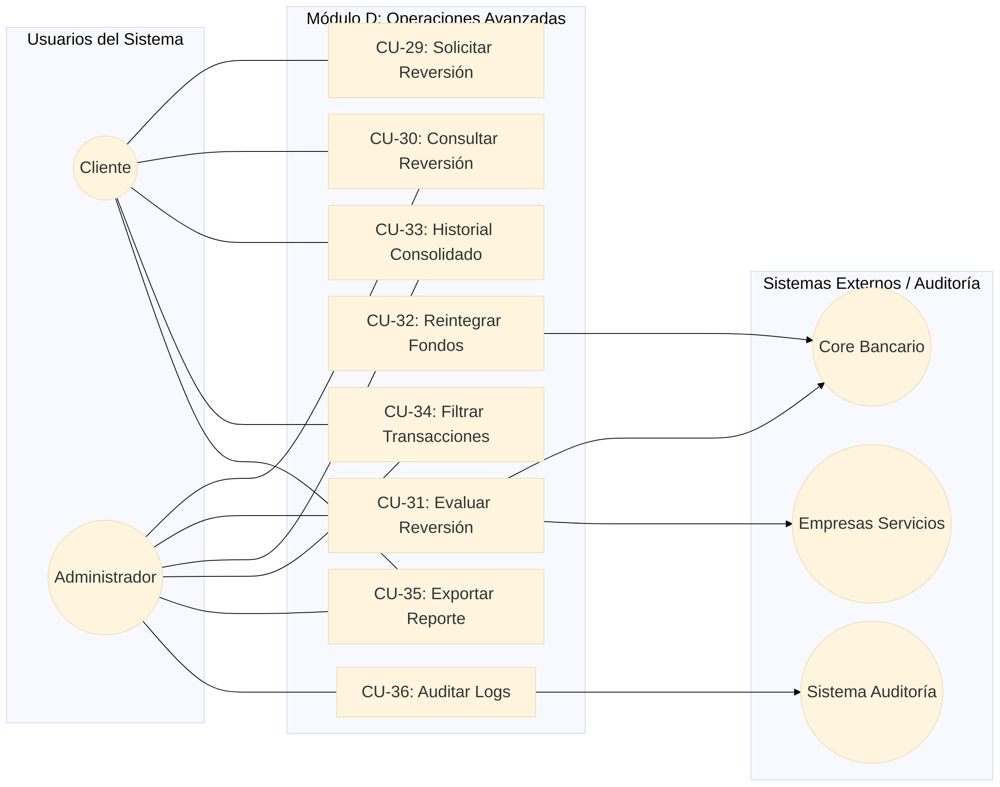
##### 2.3.2. Diagrama General de Casos de Uso del Sistema

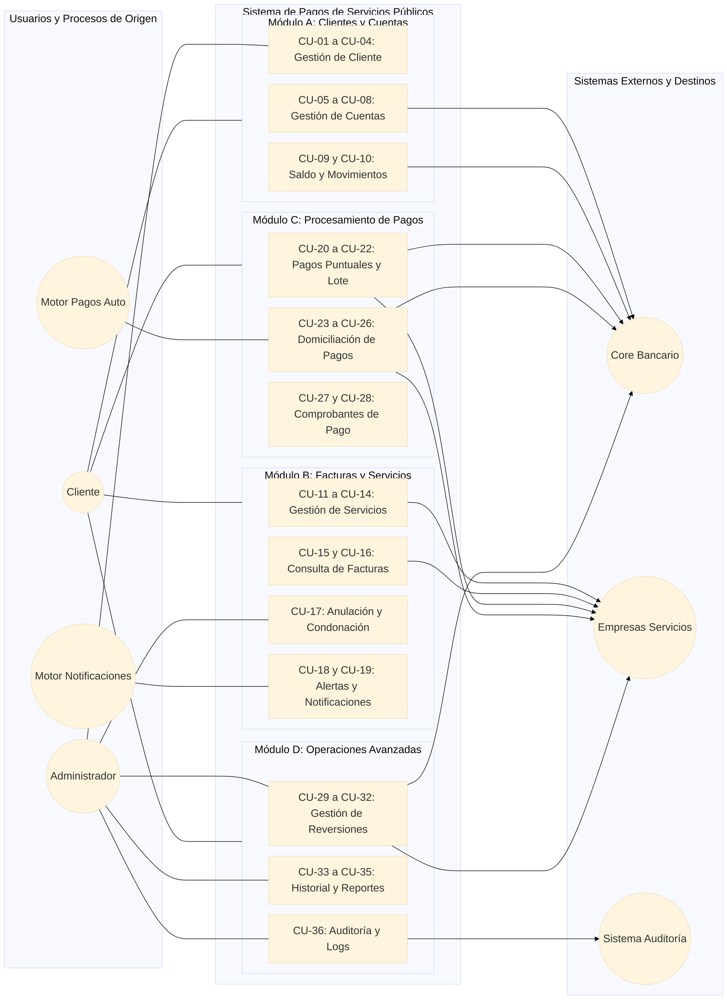

## 3. Fase 2: Diseño de Arquitectura de Software

### 3.1. Diagrama de Arquitectura Multicapa del Sistema

A continuación, se presenta la arquitectura propuesta para el sistema, estructurada bajo un enfoque multicapa que diferencia sus componentes en capas lógicas y físicas. Esta organización separa las responsabilidades de software (presentación, negocio y datos) y su distribución en la infraestructura.

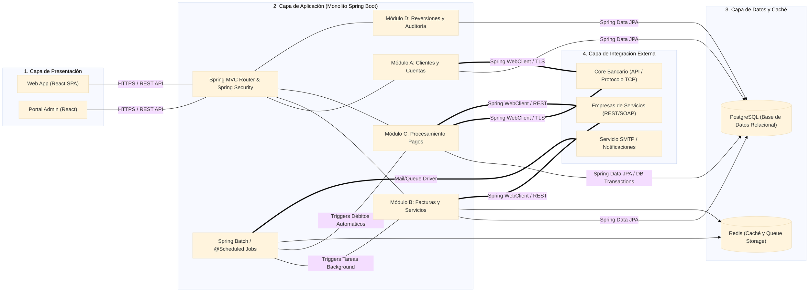

#### 3.1.2. Especificación de Componentes de Arquitectura

| Capa | Componente | Responsabilidad Técnica | Tecnologías / Protocolos |
|---|---|---|---|
| **Presentación** | Single Page Application (SPA) | Interfaces de usuario responsivas para clientes y administradores. | React / HTTPS, REST JSON |
| **Aplicación** | Monolito Modular Backend | Enrutamiento, middleware de seguridad, lógica de negocio de los Módulos A, B, C y D. | Java 21 / Spring Boot |
| **Procesos Batch** | Queue Worker & Scheduler | Ejecución programada de débitos automáticos (domiciliaciones) y despacho de alertas. | Spring Batch & @Scheduled (Cron) |
| **Almacenamiento** | Relational DB & Cache | Persistencia transaccional ACID de usuarios, pagos y logs. Gestión de sesiones y colas. | PostgreSQL, Redis |
| **Integración** | External HTTP Clients | Clientes HTTP seguros para consultar saldos en el Core Bancario y sincronizar facturas externas. | Spring WebClient, TLS / REST APIs |

### 3.2 Diagrama de Contexto C4

A continuación, se presenta el Diagrama de Contexto C4 para el Sistema de Pagos de Servicios Públicos, el cual establece las fronteras del sistema y define sus interacciones con el entorno. Este nivel inicial de abstracción permite visualizar de forma clara cómo los actores principales interactúan con la plataforma y cómo esta se integra con los diferentes sistemas externos y servicios de soporte.

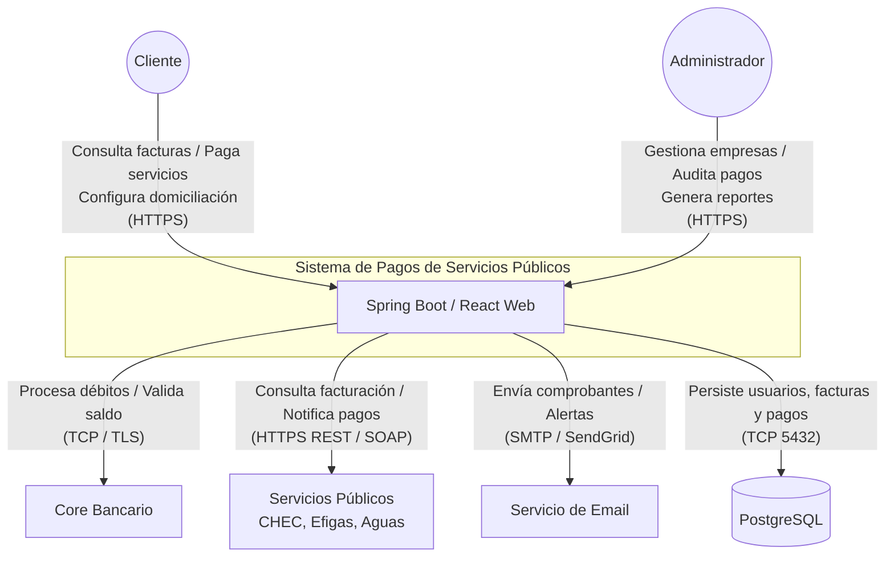

### 3.3. Diagrama de Clases

A continuación, se presenta el Diagrama de Clases para el Sistema de Pagos de Servicios Públicos. Este diagrama define la estructura estática del sistema al modelar sus entidades principales (Cliente, Cuenta, Factura, Pago, Empresa de Servicios y Reversión), junto con sus atributos, métodos operativos y relaciones de asociación, composición y agregación de la lógica de negocio.

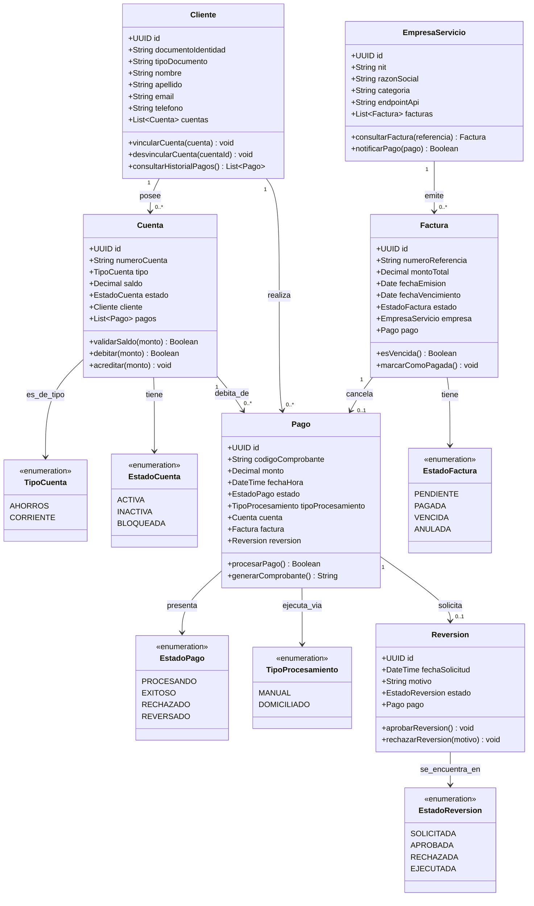

### 3.4. Diagrama Entidad-Relación (ER)

A continuación, se presenta el Diagrama Entidad-Relación para el Sistema de Pagos de Servicios Públicos. Este define la estructura del modelo físico de datos relacional para PostgreSQL, detallando las tablas, llaves primarias (PK), llaves foráneas (FK), restricciones de unicidad (UK), tipos de datos y la cardinalidad de las relaciones que garantizan la integridad referencial del sistema.

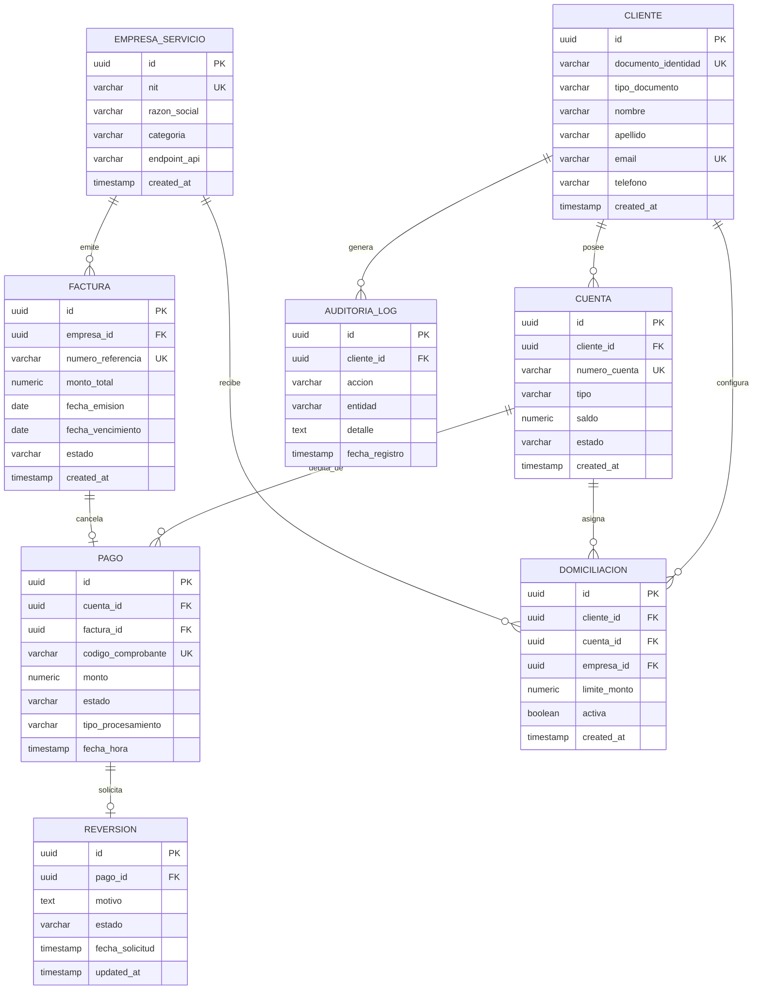

### 3.5. Diagrama de Secuencia — Flujo "Procesar Pago de Servicio Inmediato"

A continuación, se presentan los diagramas de secuencia estructurados por cada grupo de funcionalidades (Módulos A al D), detallando el comportamiento dinámico y las interacciones entre actores, frontend, backend e integraciones externas.

#### 3.5.1. Módulo A: Vincular Cuenta Bancaria y Consultar Saldo

Describe el flujo en el que el cliente asocia una cuenta de ahorros o corriente a la plataforma validándola con el Core Bancario y consulta su saldo en tiempo real.

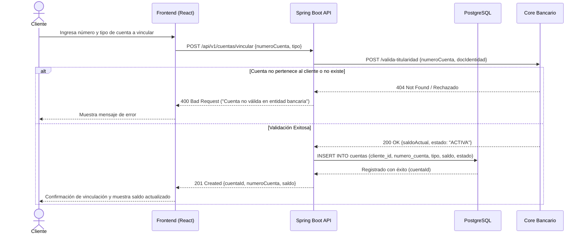

#### 3.5.2. Módulo B: Inscripción y Sincronización de Factura Pendiente

Describe el proceso donde el cliente registra la referencia de un servicio público y el sistema consulta en tiempo real el estado de la factura con la empresa prestadora.

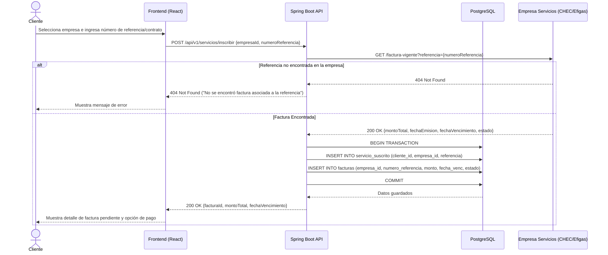

#### 3.5.3. Módulo C (Flujo Puntual): Procesar Pago de Servicio Inmediato

Describe la ejecución transaccional directa initiated por el cliente para el débito en línea y la cancelación de la factura.

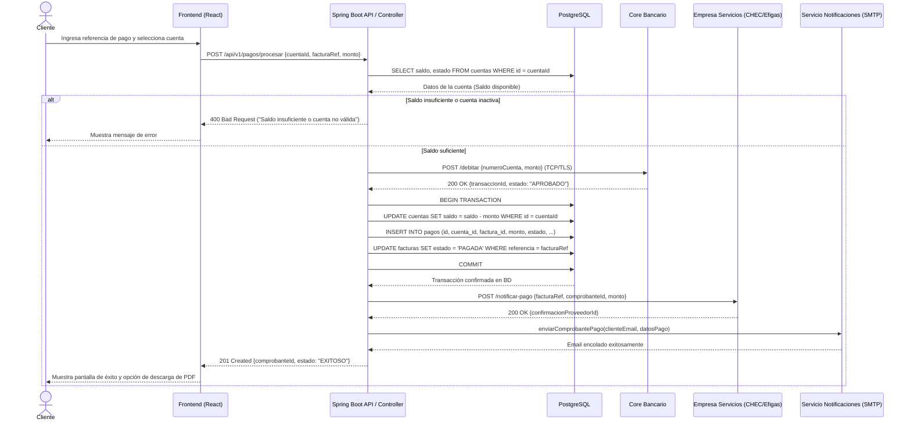

#### 3.5.4. Módulo C (Flujo Automático): Ejecución de Domiciliaciones (Proceso Batch)

Ilustra la ejecución asincrónica programada en segundo plano (Worker) para el cobro masivo de facturas automatizadas.

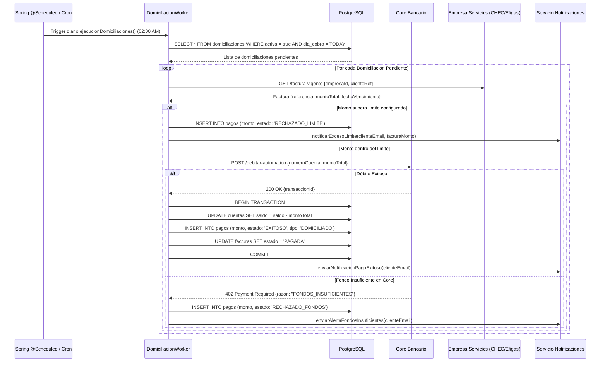

#### 3.5.5. Módulo D: Solicitud y Tramitación de Reversión de Pago

Describe el flujo de soporte donde un cliente solicita la anulación de un pago por cobro erróneo o duplicado, requiriendo validación administrativa para el reembosado de saldo.

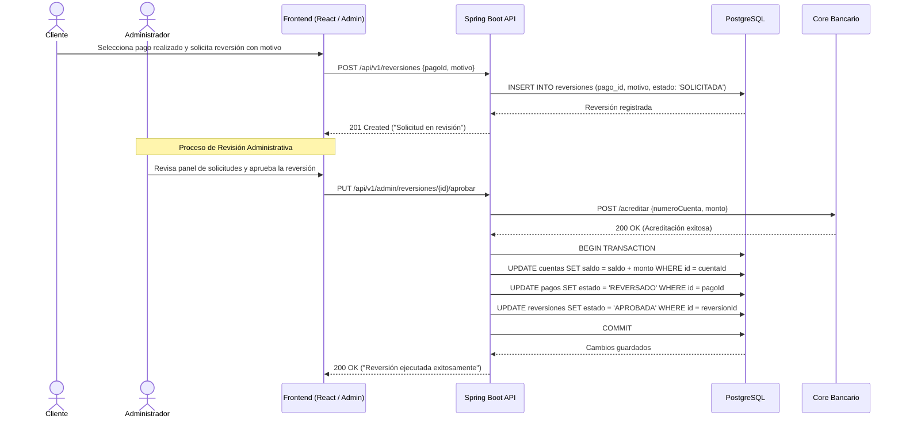

#### 3.5.6. Flujo "Procesar Pago de Servicio Inmediato"

A continuación, se presenta el Diagrama de Secuencia para el flujo crítico de negocio Procesar Pago de Servicio Inmediato. Este describe la interacción temporal entre los componentes del sistema (Frontend React, Monolito Spring Boot, PostgreSQL) y los actores/sistemas externos (Cliente, Core Bancario, Empresa de Servicios Públicos y Servicio de Email) durante la ejecución transaccional de un pago.

#### 3.5.7. Flujo "Ejecución de Domiciliaciones (Proceso Batch)"

A continuación, se presenta el Diagrama de Secuencia para el proceso automático de cobro de servicios domiciliados. Este artefacto ilustra la ejecución de tareas programadas en segundo plano (Cron/Queue Workers), las cuales iteran sobre los cobros agendados del día, validan restricciones de monto con el cliente, procesan el débito en el Core Bancario y aplican los resultados de forma masiva en la base de datos.

